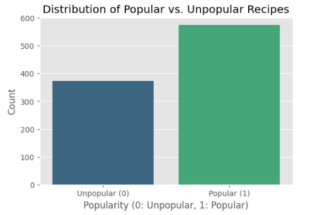
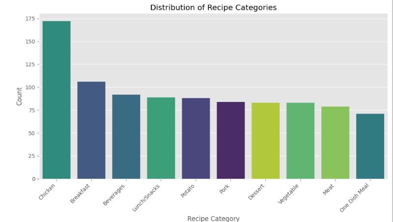
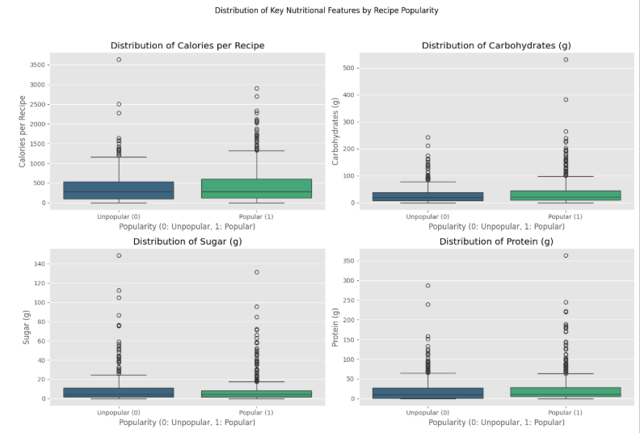
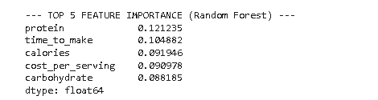

# Recipe Popularity Prediction
Predicting High-Traffic Recipes for Homepage Recommendation

## Overview
This project builds a machine learning model that predicts whether a recipe will generate high website traffic when displayed on the homepage of a recipe platform. The business goal is clear. The product team wants to avoid missing popular recipes because missing one reduces user engagement and subscription revenue. The model must reach at least 80 percent recall for popular recipes.

This repository demonstrates an end-to-end data science workflow including:
Data validation, Data cleaning, Exploratory data analysis, Feature engineering, Baseline and comparison modelling, Threshold tuning for recall optimisation, Feature importance analysis, Business-focused insights

## Dataset
The dataset contains 947 recipes with the following attributes or features:
colaries, carbohydrate, sugar, protein, category, servings, high_traffic, recipe (identifier)

## Target Definition
The high_traffic column labels recipes that produced high traffic. Missing values were treated as Low traffic so that a complete binary target could be created. The target is defined as 1 for Popular and 0 for Unpopular.
This setup aligns with the business requirement for a binary classification problem.

## Objectives
- Predict whether a recipe will generate high traffic.
- Reach recall of at least 0.80 for the Popular class.
- Support the product team in selecting daily homepage recipes.

## Data Cleaning
I repaired the non-numeric values in the servings column, standardised inconsistent entries in the category column and imputed all missing nutritional data using median values. I removed the recipe identifier column because it does not contribute to the model, and I confirmed that the cleaned dataset contained no missing values before moving into the modelling stage.

## Exploratory Analysis
The exploratory analysis showed that popular recipes make up around 60 percent of the dataset, while unpopular recipes account for the remaining 40 percent. Chicken and vegetable dishes appear most frequently across the categories, whereas other groups such as pork and potato are less common. The analysis also indicated that unpopular recipes generally have lower nutritional values. The boxplots comparing calories, sugar, carbohydrate and protein revealed that popular recipes tend to have higher values in these nutritional metrics, showing a clear difference between the two groups.

### EDA visuals:
Distribution plots for categories and target classes.

Boxplots comparing nutritional features across recipe popularity.

## Feature Engineering
I prepared the data for modelling by transforming the category column using one-hot encoding so that each recipe type became a numerical feature. The final feature matrix combined the nutritional attributes, the servings value, and the encoded category variables. This produced a clean and fully numerical dataset suitable for training the classification models, while keeping the structure consistent with the project requirements.

## Modelling
I trained two supervised learning models for this project. The first was a logistic regression model, which served as the baseline for performance comparison. The second was a random forest classifier, selected as the comparison model because it captures non-linear relationships more effectively. Both models were trained using class weights set to “balanced” to address the moderate class imbalance in the target variable, and I used stratified train–test splits to ensure that the proportion of popular and unpopular recipes remained consistent across both sets.

## Model Performance 
The logistic regression model achieved a recall of about 0.69 for the Popular class, which set the baseline for performance. The random forest model performed better, reaching a recall of roughly 0.73. Based on this improvement, I selected the random forest model as the final model because it was more effective at identifying popular recipes and aligned more closely with the recall requirement for the project.

## Threshold Tuning
The default probability threshold of 0.50 did not reach the required recall level, so I evaluated a range of lower thresholds to understand how recall changed as the model classified more recipes as popular. As the threshold decreased, recall increased, and I selected the point where recall first met the 80 percent requirement. This choice reflects the business priority, because missing a high-traffic recipe carries a higher cost than incorrectly predicting that a low-traffic recipe will be popular.

## Final Results
The final model reached the required recall level after adjusting the prediction threshold, ensuring that popular recipes were rarely missed. Precision decreased as a result of this adjustment, since more recipes were classified as popular, but this trade-off is acceptable because the business places greater importance on capturing high-traffic recipes than on avoiding false positives. This outcome aligns the model’s behaviour with the project’s goal and supports reliable decision-making for homepage recipe selection.

## Feature Importance
The random forest model showed that nutritional attributes and encoded recipe categories had the strongest influence on the predictions. These features contributed most to the model’s ability to separate popular recipes from unpopular ones. This insight also highlighted which recipe characteristics currently drive traffic patterns and which areas offer opportunities for richer data collection in future versions of the model.

### Feature Importance (Random Forest Classifier)
The final model's predictive mechanism is defined by the following top 5 features:

## Business Value
This project supports the homepage selection process by reducing the chance of missing recipes that attract high traffic. The model’s behaviour is aligned with the business goal of prioritising recall, which ensures that high-impact recipes are consistently identified. The system is straightforward to monitor and adjust, and it provides a structured approach to guiding recipe selection that can improve user engagement and support subscription growth.

## Recommendation for improvement
Future development should focus on collecting additional recipe attributes, such as preparation time and cost per serving, since these elements are likely to improve predictive accuracy. Strengthening the process for recording traffic outcomes will reduce uncertainty in the target variable and improve model reliability. Recall should be monitored over time to ensure stable performance as new data becomes available, and further work may explore enhanced features or alternative models to balance recall and precision more effectively.

